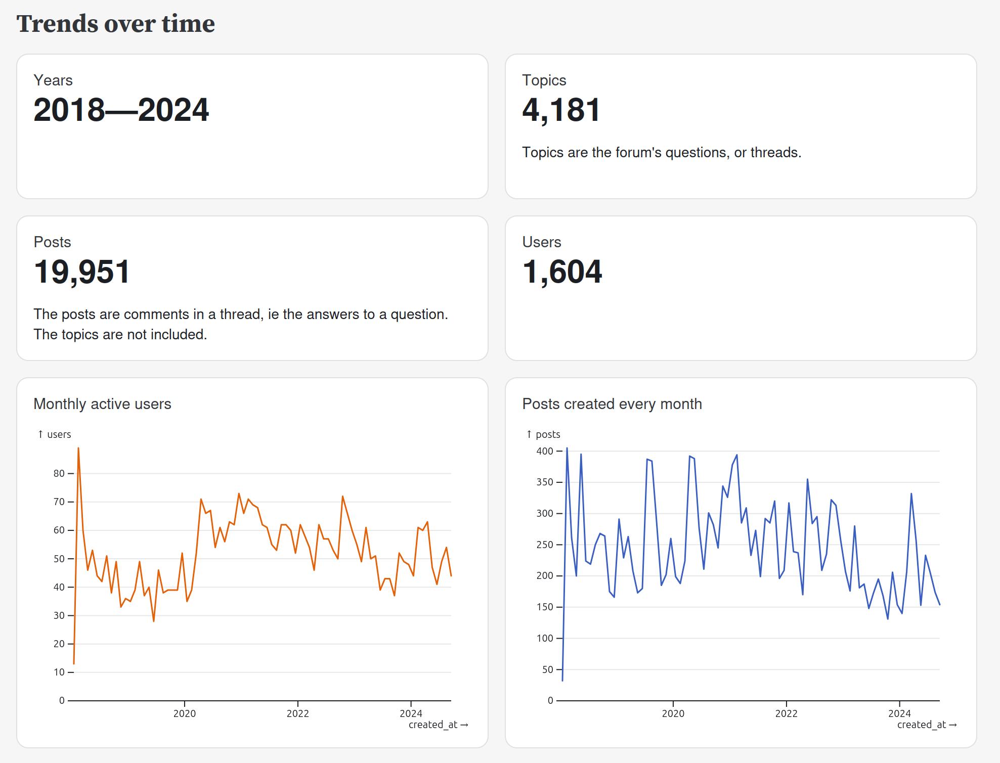
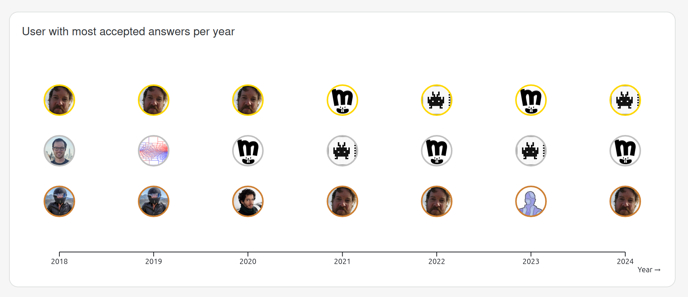
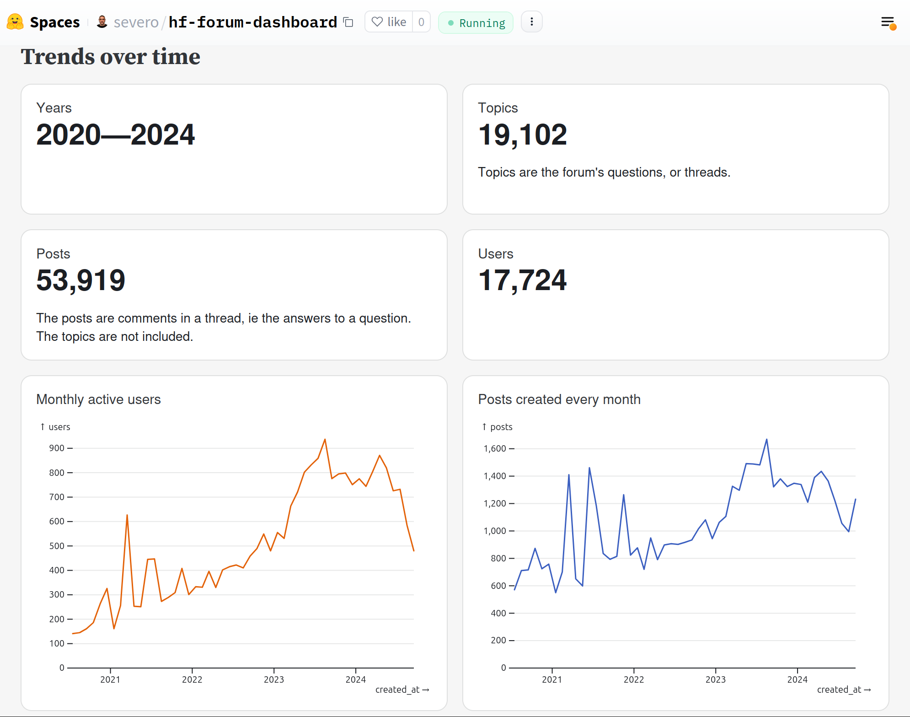

# Create a Discourse Dashboard

[Discourse](https://discourse.org/) powers [many forums](https://discourse.org/customers) today, like [Docker](https://forums.docker.com/) or [Figma](https://forum.figma.com/). I've mostly contributed with questions and comments on two of them: [Observable](https://talk.observablehq.com/) and [Hugging Face](https://discuss.huggingface.co/). I wanted to understand more about their activity, and I knew from a [previous experiment](https://observablehq.com/@severo/top-posters-on-observablehq-forum) that the [Discourse API](https://docs.discourse.org/) was super easy to use. Add `.json` to any URL, and you get the data.

I also wanted to try deploying an [Observable Framework](https://observablehq.com/framework/) app directly [from a GitHub repository](https://observablehq.com/release-notes/2024-09-24-add-data-apps-from-github) to the [Observable Cloud](https://observablehq.com/release-notes/2024-09-10-observable-cloud).

## Code

So, I created a reusable app that provides a dashboard for any Discourse-based forum. The code is hosted on GitHub: https://github.com/severo/discourse-dashboard.

Feel free to use it for your forum.

By default, it generates a static dashboard for Observable's forum (https://talk.observablehq.com). You can see it at https://severo.observablehq.cloud/observable-forum-dashboard/.




## Run locally

You can run it locally:

```bash
git clone https://github.com/severo/discourse-dashboard.git
cd discourse-dashboard
npm ci
npm run dev
```

This will open a new browser tab at http://127.0.0.1:3000/.

## Select another Discourse forum

To create a dashboard for another Discourse forum, set its URL to the `DISCOURSE_URL` environment variable:

```
npm run clean # clear the cache
DISCOURSE_URL=https://discuss.huggingface.co npm run dev
```

You can see the dashboard for the Hugging Face forum at https://huggingface.co/spaces/severo/hf-forum-dashboard.



Note that it's deployed as a [static Hugging Face space](https://huggingface.co/docs/hub/spaces-sdks-static), and I had to use an intermediate [Docker space](https://huggingface.co/spaces/severo/build-hf-forum-dashboard) to gather the data, build and deploy the static site. I documented this technique in [Build static HTML spaces](https://huggingface.co/blog/severo/build-static-html-spaces).

## Data loaders

The data is downloaded from the forum's API at build-time using [data loaders](https://observablehq.com/framework/data-loaders).

It takes about 2 minutes for Observable's forum (20k posts)

```
[missing] load /data/posts.csv → copy src/data/posts.csv → dist/_file/data/config.9de570d5.json
success 2.38 MB in 152359ms
```

And 9 minutes for Hugging Face (53k posts—you're right, it's not proportional):

```
copy src/data/posts.csv → load /data/posts.csv → [missing] success 6.73 MB in 578859ms
```

To be robust against the rate limiter, I ensure the [fetching code](see https://github.com/severo/discourse-dashboard/blob/main/src/components/fetch-and-retry.js) retries with some backoff in case of error responses.

<div class="note">
  
Use `console.warn` if you want to keep traces in the build logs. I initially used `console.log`, but it writes in STDOUT, which is reserved by the data loader to return the data. Read more in the [Output section](https://observablehq.com/framework/data-loaders#output).
  
</div>
